## Dokumentacja projektu "HealthBOOT"

Spis Treści
-----------

1.  Temat
2.  Opis projektu
3.  Członkowie zespołu i podział zadań
4.  Użyte technologie oraz biblioteki
5.  Interfejs użytkownika
6.  Funkcjonalności
7.  Struktura bazy danych
8.  Instrukcja uruchomienia
9.  Architektura systemu
10. Usługi Azure

* * * * *

Temat
-------------

Health Assistant to innowacyjna platforma stworzona przez nasz zespół z myślą o wsparciu pracy lekarzy, która oferuje niezrównane możliwości przetwarzania danych medycznych. Nasze rozwiązanie umożliwia automatyczne przetwarzanie nagrań z obchodu lekarskiego na tekst, który jest następnie przypisywany do odpowiednich pacjentów, co znacznie ułatwia zarządzanie dokumentacją medyczną.

Health Bot to interaktywny asystent, który pomaga w codziennych zadaniach, umożliwiając lekarzom i pacjentom prowadzenie rozmów i uzyskiwanie szybkiej pomocy. Dzięki temu narzędziu zwiększamy efektywność pracy medyków, pozwalając im skupić się na tym, co najważniejsze - zdrowiu pacjentów.

Z Health Assistant nowoczesna opieka medyczna staje się bardziej zorganizowana i dostępna.

Opis projektu
-----------------------

#### Health Assistant to kompleksowe narzędzie, które rewolucjonizuje sposób zarządzania opieką medyczną, zwiększając efektywność i poprawiając jakość obsługi pacjentów.

#### 1. Zarządzanie pacjentami:

-   Dodawanie pacjentów: Lekarze mogą łatwo dodać nowych pacjentów do systemu, wprowadzając ich dane osobowe i medyczne.

-   Edycja pacjentów: Możliwość aktualizacji informacji pacjentów, takich jak historia chorób, alergie czy przyjmowane leki.

-   Usuwanie pacjentów: Proste i bezpieczne usuwanie pacjentów z bazy danych.

#### 2. Karta pacjenta:

-   Wyświetlanie karty pacjenta: Szybki dostęp do szczegółowych informacji o pacjencie, w tym historii medycznej i wyników badań.

#### 3. Analiza nagrań z obchodu:

-   Przetwarzanie nagrań: System automatycznie analizuje nagrania z obchodu lekarskiego, przekształcając je na tekst.

-   Przypisywanie do pacjentów: Zapisane dane są automatycznie przypisywane do odpowiednich kart pacjentów, co ułatwia zarządzanie dokumentacją.

#### 4. Health Bot:

-   Interaktywne rozmowy: Użytkownicy mogą korzystać z Health Bota do uzyskiwania szybkich odpowiedzi na pytania medyczne oraz wsparcia w codziennych zadaniach.

#### 5. Monitorowanie zdrowia:

-   Przechowywanie danych medycznych: Użytkownicy mogą zapisywać wyniki badań, historię medyczną, alergie oraz przyjmowane leki w jednym, łatwo dostępnym miejscu.

Członkowie zespołu i podział zadań
----------------------------------

### Zespół

1.  Cezary Kretkowski

    -   Rola: Lider zespołu, Backend Developer
    -   Zadania: Zarządzanie zespołem, projektowanie i implementacja logiki backendu, wdrożenie usług Azure.
2.  Adam Rychlik

    -   Rola: Backend Developer
    -   Zadania: integracja z bazą danych, prace nad backendem
3.  Kamil Porada

    -   Rola: Frontend Developer
    -   Zadania: Kierowanie pracami nad frontendem, projektowanie i wdrożenie interfejsu użytkownika
4.  Marcin Lach

    -   Rola: Frontend
    -   Zadania: Praca nad frontendem, sporządzenie dokumentacji

Użyte technologie oraz biblioteki
---------------------------------

### Backend

-   Java
-   Spring Boot
-   spaCy
-   JDBC
-   PostgreSQL

### Frontend

-   JavaScript
-   React
-   NextJS
-   Tailwindcss

Interfejs użytkownika
---------------------
#### Strona główna

#### Logowanie

#### Okno dodawania pacjenta
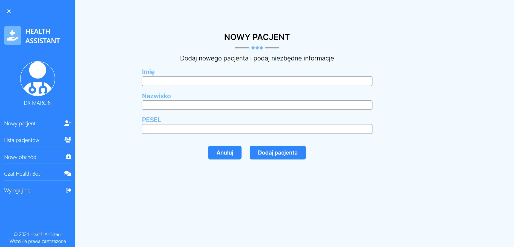

#### Lista dodanych pacjentów
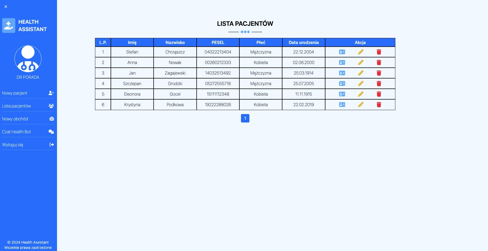

#### Okno dodawania nowego obchodu lekarskiego
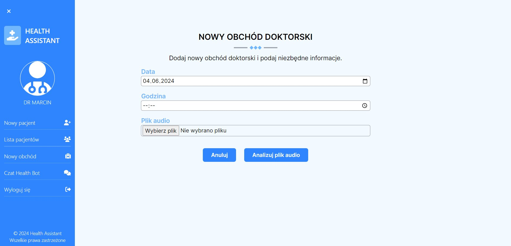

#### Okno wyników analizy z obchodu lekarskiego
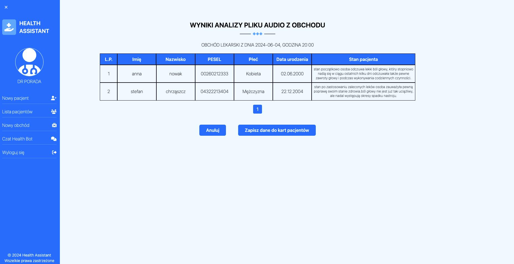

#### Okno Health Bota
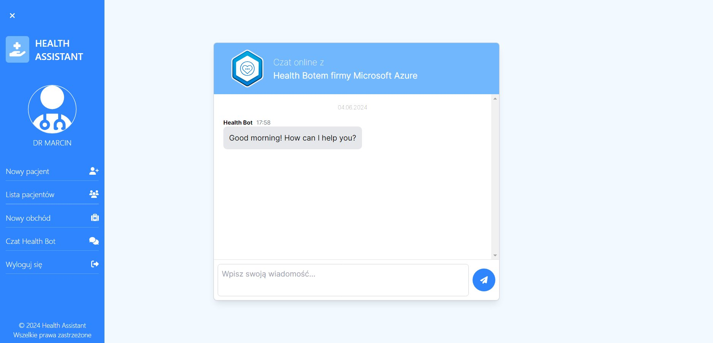

Funkcjonalności
---------------

### Backend

-   Autoryzacja i uwierzytelnianie: Zarządzanie użytkownikami, logowanie, rejestracja.
-   operacje na danych zdrowotnych: Tworzenie, odczyt, aktualizacja i usuwanie danych zdrowotnych użytkowników.
-   Obsługa błędów i walidacja: Walidacja danych wejściowych, obsługa wyjątków.
-   łączenie z usługami Azure

#### Backend
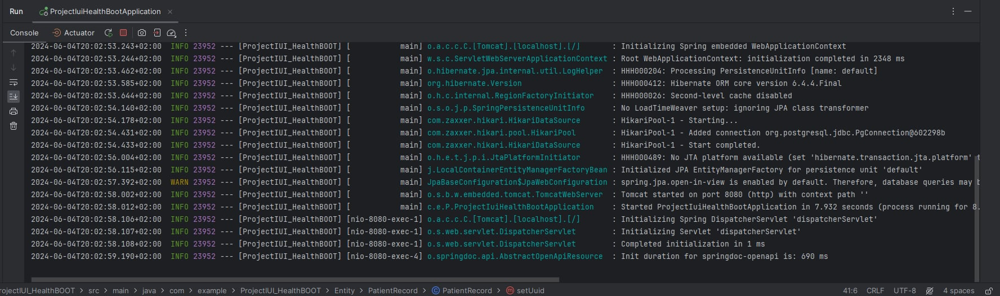

#### Rozpoznawanie mowy
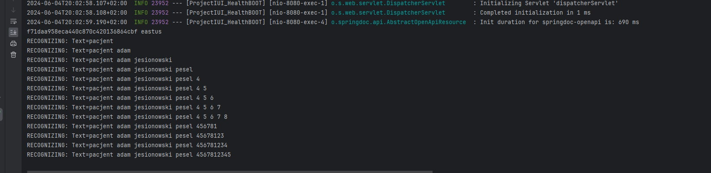

#### Swagger
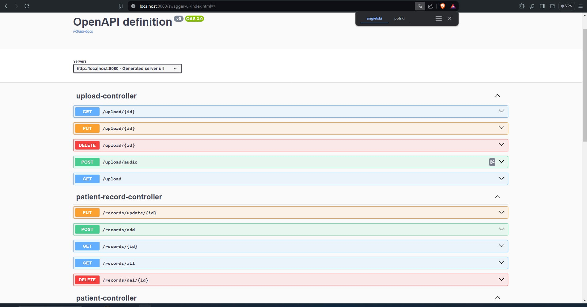

### Frontend

-   Interfejs użytkownika: Formularze logowania, rejestracji oraz zarządzania danymi zdrowotnymi.
-   Komunikacja z backendem: Wysyłanie żądań HTTP do backendu.
-   Stan aplikacji: Zarządzanie stanem aplikacji.

Struktura Bazy Danych
---------------------

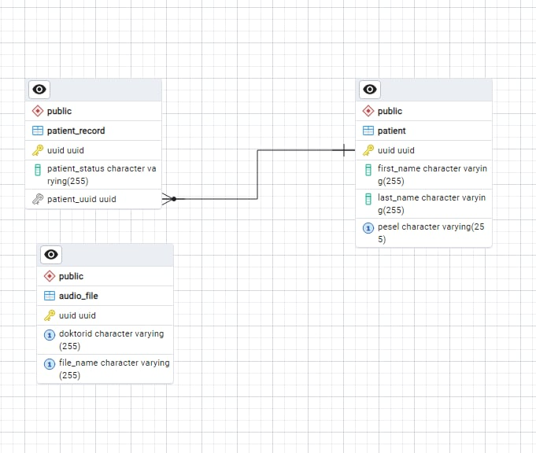

#### Tabela AudioFile
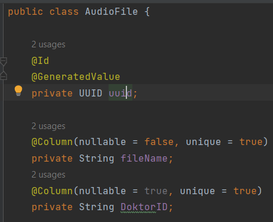

#### Tabela Patient
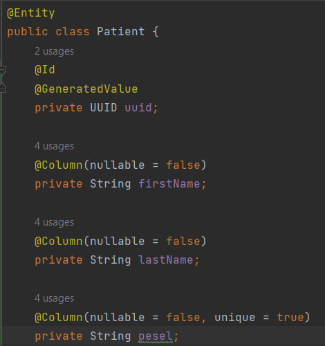

#### Tabela PatientRecord
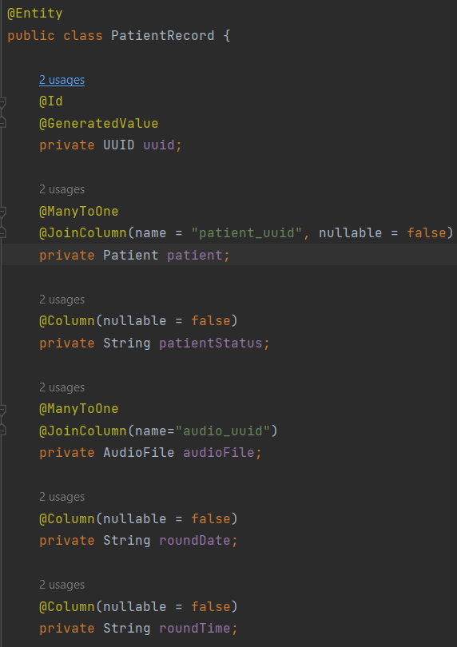

Instrukcja uruchomienia
-----------------------

### Backend

1.  Klonowanie repozytorium

bash

`git clone https://github.com/CezaryKretkowski/ProjectIUI_HealthBOOT.git
cd ProjectIUI_HealthBOOT`

2.  Instalacja bazy danych

zainstaluj bazę danych ze strony: 'https://www.postgresql.org/download/'

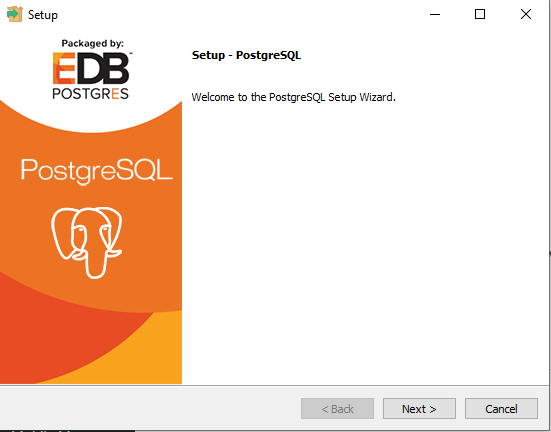

3.  Uruchomienie usługi rozpoznawania tekstu 
`git clone https://github.com/CezaryKretkowski/TextRecognitionService/`

bash

`python -m venv venv 
-- on Windows
venv\Scripts\activate 
-- on linux & MAC
source venv/bin/activate
pip install -r requirements.txt `

4.  Uruchomienie aplikacji

bash

`./mvnw spring-boot:run`

### Frontend

1.  Klonowanie repozytorium

bash

`git clone https://github.com/KamilPorada/Projekt_IUI.git
cd Projekt_IUI`

2.  Instalacja zależności

bash

`npm install`

`npm install -g next`

`npm install tailwindcss postcss autoprefixer`

`npm install @azure/msal-browser react-toastify`

3.  Uruchomienie aplikacji
`npm run build`
`next start`

Architektura systemu
--------------------

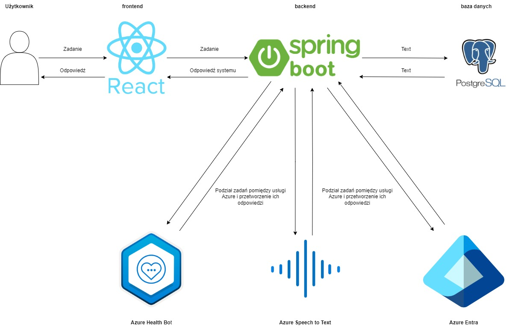

### Architektura systemu Health Assistant

System Health Assistant jest zbudowany z wykorzystaniem nowoczesnych technologii, aby zapewnić optymalne działanie i łatwość obsługi.

1.  **Frontend:**

    -   **React:** Użytkownicy interakcjonują z systemem poprzez intuicyjny interfejs użytkownika stworzony w React. Umożliwia to szybkie i responsywne reagowanie na działania użytkownika.
2.  **Backend:**

    -   **Spring Boot:** Serce systemu, które przetwarza zadania użytkowników, zarządza danymi i komunikuje się z bazą danych oraz usługami Azure. Odpowiada za logikę biznesową i dystrybucję zadań.
3.  **Baza danych:**

    -   **PostgreSQL:** Przechowuje wszystkie dane pacjentów, historię medyczną, wyniki badań oraz inne kluczowe informacje. Zapewnia bezpieczeństwo i integralność danych.
4.  **Usługi Azure:**

    -   **Azure Health Bot:** Umożliwia interaktywne rozmowy z użytkownikami, wspomagając lekarzy i pacjentów w codziennych zadaniach.
    -   **Azure Speech to Text:** Przekształca nagrania z obchodu lekarskiego na tekst, który jest następnie analizowany i przypisywany do odpowiednich pacjentów.
    -   **Azure Entra:** Zapewnia zarządzanie tożsamościami i kontrolę dostępu, dbając o bezpieczeństwo i prywatność użytkowników.

Usługi Azure
------------

### Użyte usługi Azure

W projekcie "HealthBOOT" wykorzystano następujące usługi Azure:

1.  Azure Health Bot
2.  Azure Speech to text
3.  Azure Entra
