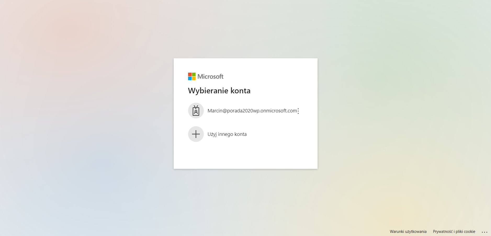

## Dokumentacja projektu "HealthBOOT"

Spis Treści
-----------

1.  Temat
2.  Opis projektu
3.  Członkowie zespołu i podział zadań
4.  Użyte technologie oraz biblioteki
5.  Interfejs użytkownika
6.  Funkcjonalności
7.  Struktura bazy danych
8.  Instrukcja uruchomienia
9.  Przykłady kodu
10.  Usługi Azure

* * * * *

Temat
-------------

Temat 2: Inteligentny system rozpoznawania intencji

System jest zintegrowany z usługą Azure "Interpretacji języka konwersacyjnego", za pośrednictwem której rozpoznaje intencję na podstawie wypowiedzi użytkownika zawartą w treści transkrypcji. Na podstawie rozpoznanej intencji udziela prostej odpowiedzi.
Rozpoznana intencja oraz odpowiedź jest zapisywana w tabeli nagranie.
System w GUI wyświetla tabelę nagranie wraz z linkiem do downloadu pliku audio, transkrypcję plku (wypowiedź użytkownika), rozpoznaną intencję oraz odpowiedź, której udzielił.

Opis projektu
-----------------------

Projekt "HealthBOOT" jest systemem służącym do zarządzania wspomagania świadczenia usług medycznych. Wydatnie wspomaga pracę lekarzy przyjmując dane z nagrań głosowych z obchodu lekarskiego. Pozwala na zbieranie i zarządzanie danymi o pacjentach oraz udostępnia inteligentny czat medyczny.

1.  Monitorowanie zdrowia:

    -   Użytkownicy mogą przechowywać swoje wyniki badań, historię medyczną, alergie, przyjmowane leki itp.
    -   System może generować przypomnienia o nadchodzących wizytach lekarskich, badaniach czy przyjmowaniu leków.
2.  Zarządzanie dokumentacją medyczną:

    -   Lekarze mogą zarządzać dokumentacją swoich pacjentów, co ułatwia monitorowanie postępów leczenia.
    -   Przechowywanie i udostępnianie dokumentów medycznych, takich jak wyniki badań, recepty czy zalecenia lekarskie.
3.  Analiza i raportowanie:

    -   Generowanie raportów zdrowotnych na podstawie przechowywanych danych.
    -   Wizualizacja danych w formie tabel, co ułatwia interpretację wyników badań i monitorowanie trendów zdrowotnych.

Członkowie zespołu i podział zadań
----------------------------------

### Zespół

1.  Cezary Kretkowski

    -   Rola: Lider zespołu, Backend Developer
    -   Zadania: Zarządzanie zespołem, projektowanie i implementacja logiki backendu, wdrożenie usług Azure.
2.  Adam Rychlik

    -   Rola: Backend Developer
    -   Zadania: integracja z bazą danych, prace nad backendem
3.  Kamil Porada

    -   Rola: Frontend Developer
    -   Zadania: Kierowanie pracami nad frontendem, projektowanie i wdrożenie interfejsu użytkownika
4.  Marcin Lach

    -   Rola: Frontend
    -   Zadania: Praca nad frontendem, sporządzenie dokumentacji

Użyte technologie oraz biblioteki
---------------------------------

### Backend

-   Java
-   Spring Boot
-   spaCy
-   JDBC
-   PostgreSQL

### Frontend

-   JavaScript
-   React
-   NextJS
-   Tailwindcss

Interfejs użytkownika
---------------------
#### Strona główna

#### Logowanie

#### Okno dodawania pacjenta

#### Lista dodanych pacjentów

#### Okno dodawania nowego obchodu lekarskiego

#### Okno wyników analizy z obchodu lekarskiego

#### Okno Health Bota

Funkcjonalności
---------------

### Backend

-   Autoryzacja i uwierzytelnianie: Zarządzanie użytkownikami, logowanie, rejestracja.
-   operacje na danych zdrowotnych: Tworzenie, odczyt, aktualizacja i usuwanie danych zdrowotnych użytkowników.
-   Obsługa błędów i walidacja: Walidacja danych wejściowych, obsługa wyjątków.
-   łączenie z usługami Azure

#### Backend

#### Rozpoznawanie mowy

#### Swagger

### Frontend

-   Interfejs użytkownika: Formularze logowania, rejestracji oraz zarządzania danymi zdrowotnymi.
-   Komunikacja z backendem: Wysyłanie żądań HTTP do backendu.
-   Stan aplikacji: Zarządzanie stanem aplikacji.

Struktura Bazy Danych
---------------------

#### Tabela AudioFile

#### Tabela Patient

#### Tabela PatientRecord

Instrukcja uruchomienia
-----------------------

### Backend

1.  Klonowanie repozytorium

bash

`git clone https://github.com/CezaryKretkowski/ProjectIUI_HealthBOOT.git
cd ProjectIUI_HealthBOOT`

2.  Instalacja bazy danych

zainstaluj bazę danych ze strony: 'https://www.postgresql.org/download/'

3.  Uruchomienie usługi rozpoznawania tekstu 
`git clone https://github.com/CezaryKretkowski/TextRecognitionService/`

bash

`python -m venv venv 
-- on Windows
venv\Scripts\activate 
-- on linux & MAC
source venv/bin/activate
pip install -r requirements.txt `

4.  Uruchomienie aplikacji

bash

`./mvnw spring-boot:run`

### Frontend

1.  Klonowanie repozytorium

bash

`git clone https://github.com/KamilPorada/Projekt_IUI.git
cd Projekt_IUI`

2.  Instalacja zależności

bash

`npm install`

`npm install -g next`

`npm install tailwindcss postcss autoprefixer`

`npm install @azure/msal-browser react-toastify`

3.  Uruchomienie aplikacji
`npm run build`
`next start`

Przykłady kodu
--------------

### Przykład kontrolera w Spring Boot

java

`@RestController
@RequestMapping("/api/health")
public class HealthController {

    @Autowired
    private HealthService healthService;

    @GetMapping("/{id}")
    public ResponseEntity<HealthData> getHealthData(@PathVariable Long id) {
        return ResponseEntity.ok(healthService.getHealthDataById(id));
    }

    @PostMapping
    public ResponseEntity<HealthData> createHealthData(@RequestBody HealthData healthData) {
        return ResponseEntity.ok(healthService.createHealthData(healthData));
    }

    @PutMapping("/{id}")
    public ResponseEntity<HealthData> updateHealthData(@PathVariable Long id, @RequestBody HealthData healthData) {
        return ResponseEntity.ok(healthService.updateHealthData(id, healthData));
    }

    @DeleteMapping("/{id}")
    public ResponseEntity<Void> deleteHealthData(@PathVariable Long id) {
        healthService.deleteHealthData(id);
        return ResponseEntity.noContent().build();
    }
}`

### Przykład komponentu w React

javascript

`import React, { useEffect, useState } from 'react';
import { useDispatch, useSelector } from 'react-redux';
import { fetchHealthData, updateHealthData } from './actions/healthActions';
import { Button, TextField } from '@material-ui/core';

const HealthDataComponent = () => {
    const dispatch = useDispatch();
    const healthData = useSelector(state => state.healthData);
    const [data, setData] = useState(healthData);

    useEffect(() => {
        dispatch(fetchHealthData());
    }, [dispatch]);

    const handleChange = (event) => {
        setData({ ...data, [event.target.name]: event.target.value });
    };

    const handleSubmit = () => {
        dispatch(updateHealthData(data));
    };

    return (
        

            <TextField
                name="name"
                label="Name"
                value={data.name}
                onChange={handleChange}
            />
            <TextField
                name="value"
                label="Value"
                value={data.value}
                onChange={handleChange}
            />
            <Button onClick={handleSubmit}>Update</Button>
        

    );
};

export default HealthDataComponent;`

Usługi Azure
------------

### Użyte usługi Azure

W projekcie "HealthBOOT" wykorzystano następujące usługi Azure:

1.  Azure Health Bot
2.  Azure Speech to text
3.  Azure Entra

### Azure Health Bot
Azure Health Bot to usługa oferowana przez Microsoft Azure, która umożliwia tworzenie inteligentnych botów konwersacyjnych przeznaczonych do zastosowań w sektorze opieki zdrowotnej. Te boty mogą być wykorzystywane przez placówki medyczne, dostawców usług zdrowotnych oraz inne organizacje związane z opieką zdrowotną w celu dostarczania pacjentom informacji medycznych, wsparcia w zakresie opieki zdrowotnej oraz zautomatyzowanej pomocy w różnych procesach medycznych.

#### Przykłady zastosowań Azure Health Bot:

1.  Wsparcie Pacjentów:

    -   Symptom Checker: Automatyczne sprawdzanie objawów i sugerowanie dalszych kroków.
    -   Informacje o Lekach: Dostarczanie informacji na temat leków, ich dawkowania i potencjalnych skutków ubocznych.
2.  Zarządzanie Wizytami:

    -   Rejestracja Wizyt: Pomoc pacjentom w rejestracji wizyt lekarskich i przypomnienia o nadchodzących terminach.
    -   Telemedycyna: Wsparcie dla wizyt online i konsultacji zdalnych.
3.  Edukacja Zdrowotna:

    -   Programy Zdrowotne: Edukowanie pacjentów na temat zdrowego stylu życia, profilaktyki chorób i zarządzania chronicznymi schorzeniami.

### Azure Speech To Text:
Azure Speech to Text to usługa oferowana przez Microsoft Azure, która umożliwia przekształcanie mowy na tekst. Jest częścią szerszej platformy Azure Cognitive Services, która oferuje różnorodne usługi oparte na sztucznej inteligencji. Speech to Text jest wykorzystywana w różnych aplikacjach, od transkrypcji rozmów i nagrań po interakcje głosowe z użytkownikami w czasie rzeczywistym.

#### Kluczowe cechy Azure Speech to Text:

1.  Dokładność i Adaptacyjność:

    -   Zaawansowane Algorytmy Rozpoznawania Mowy: Wykorzystuje zaawansowane algorytmy oparte na głębokim uczeniu do dokładnego rozpoznawania mowy.
    -   Adaptacyjność: Możliwość dostosowania modeli rozpoznawania mowy do specyficznych potrzeb użytkownika, takich jak słownictwo branżowe czy akcenty.
2.  Wsparcie dla Wielu Języków i Dialektów:

    -   Globalne Zasięg: Obsługuje wiele języków i dialektów, co czyni ją idealną dla międzynarodowych zastosowań.
    -   Stale Aktualizowana Baza Językowa: Microsoft regularnie aktualizuje i rozszerza wsparcie językowe.
3.  Integracja z Różnymi Platformami:

    -   API i SDK: Usługa jest dostępna poprzez łatwe w użyciu API i SDK dla różnych platform, w tym dla Androida, iOS, i aplikacji webowych.
    -   Integracja z Innymi Usługami Azure: Łatwa integracja z innymi usługami Azure, takimi jak Azure Cognitive Services, Azure Bot Service i Azure Machine Learning.
4.  Bezpieczeństwo i Prywatność:

    -   Szyfrowanie Danych: Dane są szyfrowane zarówno w czasie przesyłania, jak i przechowywania, co zapewnia ich bezpieczeństwo.
    -   Zgodność z Regulacjami: Usługa jest zgodna z wieloma regulacjami dotyczącymi ochrony danych, takimi jak RODO, HIPAA i inne.
5.  Elastyczne Opcje Implementacji:

    -   Transkrypcja w Czasie Rzeczywistym: Możliwość transkrypcji mowy w czasie rzeczywistym, co jest szczególnie przydatne w aplikacjach takich jak napisy na żywo, asystenci głosowi czy systemy call center.
    -   Transkrypcja Asynchroniczna: Możliwość przetwarzania nagrań audio w trybie batch, co jest idealne dla aplikacji wymagających analizy wcześniej zarejestrowanych rozmów.Azure Speech to Text to usługa oferowana przez Microsoft Azure, która umożliwia przekształcanie mowy na tekst. Jest częścią szerszej platformy Azure Cognitive Services, która oferuje różnorodne usługi oparte na sztucznej inteligencji. Speech to Text jest wykorzystywana w różnych aplikacjach, od transkrypcji rozmów i nagrań po interakcje głosowe z użytkownikami w czasie rzeczywistym.

### Azure Entra
Azure Entra to platforma Microsoft Azure, która skupia się na zarządzaniu tożsamościami i dostępem. Azure Entra pomaga organizacjom zabezpieczać dostęp do zasobów, upraszczać zarządzanie tożsamościami i umożliwiać bezpieczne korzystanie z aplikacji oraz usług w chmurze. Azure Entra integruje różne usługi związane z tożsamościami, oferując kompleksowe podejście do zarządzania tożsamościami w organizacjach.

#### Kluczowe usługi i funkcje Azure Entra:

1.  Azure Active Directory (Azure AD):

    -   Zarządzanie Tożsamościami i Dostępem: Umożliwia zarządzanie tożsamościami użytkowników oraz kontrolę dostępu do aplikacji i zasobów.
    -   SSO (Single Sign-On): Umożliwia użytkownikom logowanie się raz, aby uzyskać dostęp do wielu aplikacji.
    -   MFA (Multi-Factor Authentication): Zapewnia dodatkową warstwę bezpieczeństwa poprzez wymaganie kilku form uwierzytelniania.
2.  Azure AD B2C (Business to Consumer):

    -   Tożsamość Klienta: Umożliwia firmom zarządzanie tożsamościami klientów i zapewnia bezpieczny dostęp do aplikacji konsumenckich.
    -   Personalizacja i Branding: Pozwala na personalizację procesu logowania i rejestracji oraz dostosowanie wyglądu i stylu do marki.
3.  Azure AD B2B (Business to Business):

    -   Zarządzanie Gościnnymi Tożsamościami: Umożliwia organizacjom bezpieczne udostępnianie zasobów partnerom biznesowym i dostawcom.
    -   Bezproblemowa Integracja: Umożliwia partnerom korzystanie z własnych tożsamości w celu uzyskania dostępu do zasobów.
4.  Conditional Access:

    -   Kontrola Dostępu opartego na Warunkach: Umożliwia tworzenie polityk dostępu, które określają warunki, jakie muszą być spełnione, aby uzyskać dostęp do zasobów (np. lokalizacja, stan urządzenia, rola użytkownika).
    -   Adaptacyjne Zarządzanie Ryzykiem: Automatycznie dostosowuje poziom zabezpieczeń na podstawie analizy ryzyka.
5.  Identity Protection:

    -   Ochrona Przed Zagrożeniami: Wykrywanie i reagowanie na podejrzane działania oraz potencjalne zagrożenia związane z tożsamościami użytkowników.
    -   Analiza Ryzyka: Ocena ryzyka na podstawie danych behawioralnych i historycznych.
6.  Privileged Identity Management (PIM):

    -   Zarządzanie Tożsamościami Uprzywilejowanymi: Kontrola i monitorowanie dostępu do zasobów przez użytkowników uprzywilejowanych.
    -   Just-In-Time Access: Umożliwienie dostępu do zasobów tylko wtedy, gdy jest to konieczne, co minimalizuje ryzyko nadużyć.

